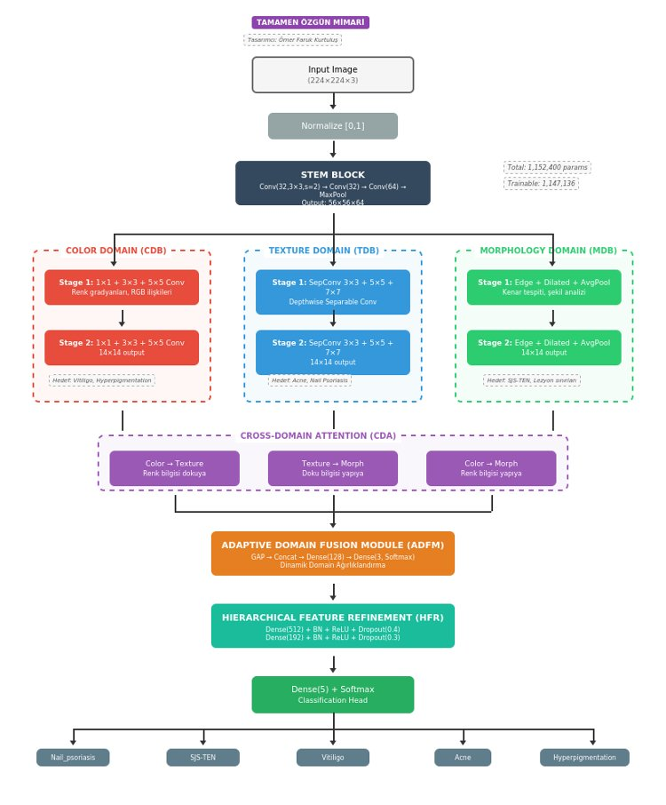
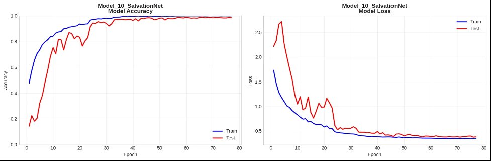
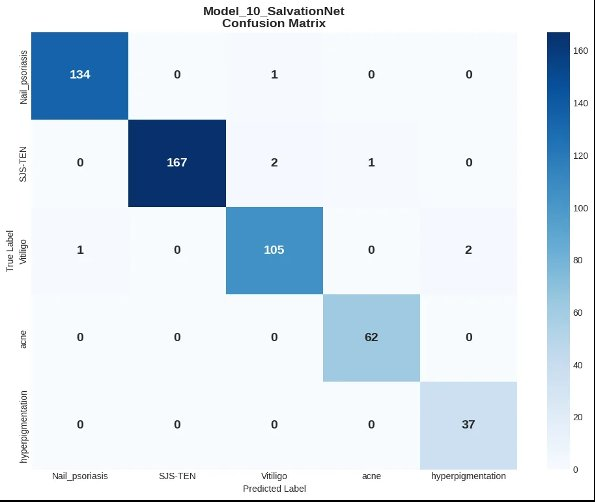
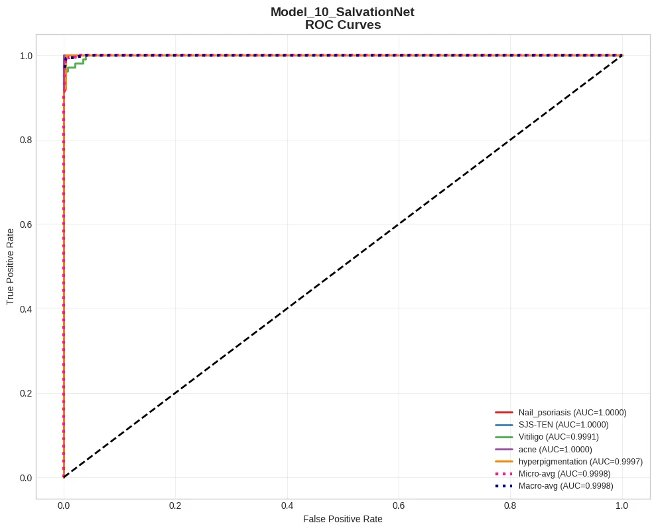

# Comparative Analysis of Deep Learning Architectures for Skin Disease Classification

**A systematic evaluation of transfer learning, hybrid dual-backbone models, attention mechanisms, multi-scale feature extraction, and a novel from-scratch architecture (SalvationNet) for automated dermatological diagnosis across five clinical categories.**

---

**Author:** Ömer Faruk Kurtuluş  
**Affiliation:** Department of Computer Engineering, Faculty of Engineering, Atatürk University  
**Date:** December 2025

---

## Table of Contents

- [Abstract](#abstract)
- [Dataset](#dataset)
- [Methodology](#methodology)
  - [Data Cleaning and Preparation](#data-cleaning-and-preparation)
  - [Stratified Splitting and Leakage Audit](#stratified-splitting-and-leakage-audit)
  - [Class Weighting](#class-weighting)
  - [Data Augmentation](#data-augmentation)
  - [Training Callbacks](#training-callbacks)
- [Exploratory Data Analysis](#exploratory-data-analysis)
- [Model Architectures](#model-architectures)
  - [Model 1 — Custom CNN (Baseline)](#model-1--custom-cnn-baseline)
  - [Model 2 — EfficientNetV2-S](#model-2--efficientnetv2-s)
  - [Model 3 — ConvNeXt Tiny](#model-3--convnext-tiny)
  - [Model 4 — DenseNet121 + InceptionV3](#model-4--densenet121--inceptionv3)
  - [Model 5 — ResNet50 + VGG16](#model-5--resnet50--vgg16)
  - [Model 6 — EfficientNetB0 + MobileNetV2](#model-6--efficientnetb0--mobilenetv2)
  - [Model 7 — Xception + InceptionResNetV2](#model-7--xception--inceptionresnetv2)
  - [Model 8 — InceptionResNetV2 + CBAM](#model-8--inceptionresnetv2--cbam)
  - [Model 9 — Xception + FPN](#model-9--xception--fpn)
  - [Model 10 — SalvationNet (Novel Architecture)](#model-10--salvationnet-novel-architecture)
- [Results](#results)
  - [Overall Performance Comparison](#overall-performance-comparison)
  - [Performance Ranking](#performance-ranking)
  - [Key Findings](#key-findings)
- [SalvationNet — In Depth](#salvationnet--in-depth)
  - [Clinical Motivation](#clinical-motivation)
  - [Architectural Overview](#architectural-overview)
  - [Component Details](#component-details)
  - [Hyperparameter Optimization](#hyperparameter-optimization)
  - [Training Dynamics](#training-dynamics)
  - [Confusion Matrix Analysis](#confusion-matrix-analysis)
  - [ROC Curves and AUC Analysis](#roc-curves-and-auc-analysis)
  - [Summary of Original Contributions](#summary-of-original-contributions)
- [Repository Structure](#repository-structure)
- [Getting Started](#getting-started)
- [Citation](#citation)
- [Acknowledgments](#acknowledgments)
- [License](#license)

---

## Abstract

Dermatological conditions such as Acne, Vitiligo, Hyperpigmentation, Nail Psoriasis, and Stevens-Johnson Syndrome / Toxic Epidermal Necrolysis (SJS-TEN) remain diagnostically challenging, particularly in regions with limited access to specialist care. Early and accurate identification is critical — SJS-TEN, for instance, carries mortality rates exceeding 30% if intervention is delayed. This work presents a systematic comparison of **ten deep learning architectures** for automated classification of these five conditions using 3,411 curated dermatoscopic images.

The evaluated architectures span four distinct paradigms:

**(i)** A baseline CNN trained from scratch to quantify the lower bound of performance without transfer learning.  
**(ii)** Single-backbone transfer learning using EfficientNetV2-S and ConvNeXt Tiny with two-phase fine-tuning.  
**(iii)** Four dual-backbone hybrid models (DenseNet121+InceptionV3, ResNet50+VGG16, EfficientNetB0+MobileNetV2, Xception+InceptionResNetV2) that concatenate feature representations from complementary architectures.  
**(iv)** Attention-augmented and multi-scale approaches (InceptionResNetV2+CBAM, Xception+FPN), and a fully original architecture designed from scratch.

The top-performing model, EfficientNetV2-S with two-phase fine-tuning, achieved **99.61% test accuracy** with a macro-average ROC-AUC of 1.0000. Notably, **SalvationNet** — a Tri-Domain Adaptive Fusion Network conceived and implemented entirely by the author without any pre-trained weights — attained **98.63% accuracy** and a macro-average AUC of **0.9998** using only **1.15M parameters**. This places it ahead of architectures with 48 to 67 times more parameters, including Xception+InceptionResNetV2 (77.7M params, 98.05%) and InceptionResNetV2+CBAM (55.5M params, 97.85%). SalvationNet introduces a biologically motivated three-branch design that separately models color, texture, and morphological features — mirroring the systematic protocol employed by dermatologists in clinical examination — and fuses them through cross-domain attention and learned adaptive weighting.

For a comprehensive treatment of all ten architectures, including detailed training curves, confusion matrices, ROC analyses, and flowcharts for every model, refer to the **[full research document (PDF)](docs/Comparative_Analysis_Deep_Learning_Skin_Disease.pdf)**.

---

## Dataset

This study uses the **Skin Disease Classification Dataset** published on Mendeley Data (Khushbu, 2024). The original collection contains 9,548 dermatoscopic images acquired from hospitals and online clinical resources across multiple countries. It covers five skin conditions that are comparatively underrepresented in major benchmarks such as ISIC2019 and HAM10000.

| Class | Original Count | After Cleaning | Clinical Presentation |
|:------|:--------------:|:--------------:|:----------------------|
| SJS-TEN | 3,164 | 1,130 | Severe epidermal detachment, mucosal erosions, widespread erythema |
| Nail Psoriasis | 2,520 | 900 | Nail pitting, onycholysis, subungual hyperkeratosis, oil-drop discoloration |
| Vitiligo | 2,016 | 721 | Depigmented macules and patches from melanocyte destruction |
| Acne | 1,148 | 410 | Comedones, papules, pustules, and nodules from follicular occlusion |
| Hyperpigmentation | 700 | 250 | Dark patches from excess melanin deposition |
| **Total** | **9,548** | **3,411** | |

The cleaning process removed artificially augmented images (superpixel transformations, saturation and hue-filtered variants, and other preprocessed duplicates) that were present in the original release. By retaining only raw, unprocessed clinical photographs, the resulting 3,411-image dataset ensures that model performance reflects genuine feature learning rather than memorization of augmentation artifacts. The class imbalance ratio between the largest (SJS-TEN: 1,130) and smallest (Hyperpigmentation: 250) classes is 4.52:1.

**Dataset Reference:**

> Khushbu, S. A. (2024). *Skin Disease Classification Dataset*. Mendeley Data, V1.  
> DOI: [10.17632/3hckgznc67.1](https://doi.org/10.17632/3hckgznc67.1)  
> License: CC BY 4.0 — Daffodil International University

---

## Methodology

### Data Cleaning and Preparation

The original 9,548-image dataset contained a significant proportion of artificially pre-processed images. Outlier analysis identified that 10.03% of images fell outside acceptable statistical norms. All synthetically modified images were removed, yielding 3,411 clinically authentic photographs. All images were resized to 224x224x3 for models operating at standard resolution, while the Xception+InceptionResNetV2 hybrid used native 299x299 input.

### Stratified Splitting and Leakage Audit

The dataset was partitioned using stratified random sampling to preserve class proportions across splits:

| Split | Samples | Proportion | Purpose |
|:------|:-------:|:----------:|:--------|
| Training | 2,387 | 70% | Model parameter optimization |
| Validation | 512 | 15% | Hyperparameter tuning and early stopping |
| Test | 512 | 15% | Final, held-out performance evaluation |

Class distribution deviation between the original and each split was verified to remain below 0.11%. A data leakage audit confirmed zero file overlap across all three partitions.

### Class Weighting

Inverse-frequency class weights were computed to compensate for the 4.52:1 imbalance ratio, ensuring that minority classes (Hyperpigmentation, Acne) received proportionally higher loss contributions during training:

| Class | Weight |
|:------|:------:|
| Hyperpigmentation | 2.728 |
| Acne | 1.663 |
| Vitiligo | 0.945 |
| Nail Psoriasis | 0.758 |
| SJS-TEN | 0.604 |

### Data Augmentation

Augmentation was applied exclusively to the training set and adapted per model architecture. The baseline strategy consisted of random rotation (±10 degrees), random zoom (±10%), and horizontal flipping. Models with deeper feature hierarchies or from-scratch training additionally incorporated random contrast (±5%) and random brightness (±5%) adjustments. No augmentation was applied to validation or test sets at any point.

### Training Callbacks

Three callback mechanisms were employed across all models (with architecture-specific patience values):

- **EarlyStopping** — monitors validation accuracy; patience 10–20 epochs depending on architecture depth
- **ModelCheckpoint** — saves the model state at the epoch with highest validation accuracy
- **ReduceLROnPlateau** — halves the learning rate (factor=0.5) when validation loss stalls for 3–7 consecutive epochs

---

## Exploratory Data Analysis

RGB channel analysis across all five classes revealed clinically consistent statistical patterns. The SJS-TEN class exhibited the highest mean Red channel intensity (168.97), consistent with the inflammatory erythema that characterizes the condition. Nail Psoriasis displayed the lowest average brightness (109.39), reflecting the dark, irregular textures of affected nails. The stark chromatic contrast between Hyperpigmentation (high melanin, dark patches) and Vitiligo (melanocyte loss, white patches) serves as a primary discriminative feature — a property explicitly exploited by the Color Domain Branch in the proposed SalvationNet architecture.

Class-level pixel intensity distributions and inter-channel correlations were further analyzed to inform augmentation strategy design and to validate that the cleaning process had not introduced distributional bias.

---

## Model Architectures

### Model 1 — Custom CNN (Baseline)

A four-block convolutional network (32, 64, 128, 256 filters) with Batch Normalization and MaxPooling, trained from scratch using Adam optimizer and categorical crossentropy. Total parameter count: 1.24M. This model serves as the lower-bound reference; its **32.23% test accuracy** demonstrates severe overfitting and confirms that dermatological image classification requires either transfer learning or architecturally informed design.

### Model 2 — EfficientNetV2-S

Two-phase transfer learning: Phase 1 freezes the EfficientNetV2-S backbone (pre-trained on ImageNet) and trains only the custom classification head (GlobalAveragePooling, BatchNorm, Dense(256)+L2, Dropout(0.5), Dense(5)). Phase 2 unfreezes the last 50 layers for fine-tuning at a learning rate of 1e-5. The Fused-MBConv blocks in EfficientNetV2-S provide faster training convergence compared to earlier EfficientNet variants. Total parameters: 21.5M. Training time per epoch: 7.52s. **Test accuracy: 99.61%** — the highest in this study, with Cohen's Kappa of 0.9948 and ROC-AUC of 1.0000.

### Model 3 — ConvNeXt Tiny

A modernized pure-CNN architecture from Meta AI that incorporates design principles from Vision Transformers: patchify stem (4x4 non-overlapping convolution), 7x7 depthwise convolutions, inverted bottleneck blocks, GELU activation, and Layer Normalization. Two-phase training: 20 epochs frozen, 16 epochs fine-tuning the last 30 layers at 1e-5. Total parameters: 28.6M. Training time per epoch: 6.00s. **Test accuracy: 98.83%.**

### Model 4 — DenseNet121 + InceptionV3

A dual-backbone hybrid architecture that concatenates Global Average Pooled features from two frozen ImageNet-pretrained backbones: DenseNet121 (dense connectivity, feature reuse) and InceptionV3 (multi-scale inception modules). Each backbone feeds a parallel classification pathway (Dense, Dropout, Dense, Dropout) before concatenation and final classification. Bayesian hyperparameter optimization via Keras Tuner (15 trials, 40.25 min search). Total parameters: 30.0M (1.1M trainable). Best epoch: 17 of 32. Training time per epoch: 5.65s. **Test accuracy: 99.41%** — the best performance-to-speed tradeoff, achieving near-top accuracy at the second-fastest epoch time.

### Model 5 — ResNet50 + VGG16

Combines residual learning (skip connections enabling gradient flow through 50 layers) with classical hierarchical feature extraction (VGG16's uniform 3x3 convolution stacks). Both backbones frozen with ImageNet weights. Bayesian optimization over 15 trials (24.43 min). Total parameters: 39.1M (821K trainable). Best epoch: 35 of 50. Training time per epoch: 3.34s. **Test accuracy: 98.83%.**

### Model 6 — EfficientNetB0 + MobileNetV2

A lightweight hybrid pairing compound-scaled features (EfficientNetB0) with depthwise separable convolutions (MobileNetV2). Both architectures were designed for mobile and edge deployment, making this the most computationally efficient hybrid in the study. Bayesian optimization over 15 trials (29.08 min). Total parameters: 8.3M (1.97M trainable). Training time per epoch: 3.60s. **Test accuracy: 98.83%.**

### Model 7 — Xception + InceptionResNetV2

The largest architecture evaluated, combining extreme inception (Xception, depthwise separable convolutions) with inception-residual modules (InceptionResNetV2) at native 299x299 resolution. Despite its 77.7M parameters (2.49M trainable), this model achieved **98.05% test accuracy** — lower than several smaller architectures, illustrating diminishing returns from parameter scaling. Bayesian optimization: 77.55 min search. Training time per epoch: 12.09s.

### Model 8 — InceptionResNetV2 + CBAM

Integrates the Convolutional Block Attention Module (CBAM) on top of frozen InceptionResNetV2 features. CBAM applies sequential channel attention (via shared MLP with reduction ratio) and spatial attention (via 7x7 convolution on pooled feature maps) to refine feature representations. Total parameters: 55.5M (1.22M trainable). Bayesian optimization: 67.49 min search. Training time per epoch: 10.39s. **Test accuracy: 97.85%.**

### Model 9 — Xception + FPN

Constructs a Feature Pyramid Network (FPN) on three scales of frozen Xception features: C3 (block4_sepconv2_act, 256 channels), C4 (block13_sepconv2_act, 728 channels), and C5 (block14_sepconv2_act, 1024 channels). Lateral connections with 1x1 convolutions and top-down pathway generate pyramid levels P3, P4, P5. The multi-scale classification head concatenates GlobalAveragePooled features from all three levels (768 total features). Fixed hyperparameters (no Keras Tuner search). Total parameters: 23.8M (2.97M trainable). Total training time: 4.98 min. Training time per epoch: 9.30s. **Test accuracy: 99.22%** with only 4 misclassifications out of 512 test samples.

### Model 10 — SalvationNet (Novel Architecture)

A **fully original Tri-Domain Adaptive Fusion Network** designed and implemented entirely by the author, without using any pre-trained weights, existing backbone networks, or external architectural components. SalvationNet processes dermatoscopic images through three specialized parallel branches — Color, Texture, and Morphology — that mirror the systematic clinical examination protocol used by dermatologists. With only **1.15M parameters** trained entirely from scratch, it achieved **98.63% test accuracy**, surpassing architectures with 48 to 67 times more parameters. A comprehensive analysis follows in the [dedicated section below](#salvationnet--in-depth).

---

## Results

### Overall Performance Comparison

| Rank | Model | Accuracy | Precision | Recall | F1-Score | Cohen's Kappa | ROC-AUC | Total Params | s/epoch |
|:----:|:------|:--------:|:---------:|:------:|:--------:|:-------------:|:-------:|:------------:|:-------:|
| 1 | **EfficientNetV2-S** | **99.61%** | 99.61% | 99.61% | 99.61% | 0.9948 | 1.0000 | 21.5M | 7.52 |
| 2 | DenseNet121 + InceptionV3 | 99.41% | 99.42% | 99.41% | 99.42% | 0.9923 | 1.0000 | 30.0M | 5.65 |
| 3 | Xception + FPN | 99.22% | — | — | 99.22% | — | 0.9995 | 23.8M | 9.30 |
| 4 | ConvNeXt Tiny | 98.83% | 98.83% | 98.83% | 98.83% | 0.9845 | 0.9999 | 28.6M | 6.00 |
| 5 | ResNet50 + VGG16 | 98.83% | 98.84% | 98.83% | 98.83% | 0.9845 | 0.9997 | 39.1M | 3.34 |
| 6 | EfficientNetB0 + MobileNetV2 | 98.83% | 98.83% | 98.83% | 98.83% | 0.9845 | 0.9997 | 8.3M | 3.60 |
| **7** | **SalvationNet\*** | **98.63%** | **98.66%** | **98.63%** | **98.64%** | **0.9819** | **0.9998** | **1.15M** | **5.50** |
| 8 | Xception + InceptionResNetV2 | 98.05% | 98.11% | 98.05% | 98.04% | 0.9742 | 0.9995 | 77.7M | 12.09 |
| 9 | InceptionResNetV2 + CBAM | 97.85% | 97.87% | 97.85% | 97.85% | 0.9716 | 0.9990 | 55.5M | 10.39 |
| 10 | Custom CNN (Baseline) | 32.23% | 19.98% | 32.23% | — | — | 0.60 | 1.24M | — |

\* *SalvationNet is trained entirely from scratch without any pre-trained weights or existing backbone networks.*

### Performance Ranking

| Rank | Model | Test Accuracy | Category |
|:----:|:------|:------------:|:---------|
| 1 | EfficientNetV2-S | 99.61% | Single-backbone transfer learning |
| 2 | DenseNet121 + InceptionV3 | 99.41% | Dual-backbone hybrid |
| 3 | Xception + FPN | 99.22% | Multi-scale feature extraction |
| 4 | ConvNeXt Tiny | 98.83% | Single-backbone transfer learning |
| 5 | ResNet50 + VGG16 | 98.83% | Dual-backbone hybrid |
| 6 | EfficientNetB0 + MobileNetV2 | 98.83% | Dual-backbone hybrid |
| **7** | **SalvationNet\*** | **98.63%** | **Novel from-scratch architecture** |
| 8 | Xception + InceptionResNetV2 | 98.05% | Dual-backbone hybrid |
| 9 | InceptionResNetV2 + CBAM | 97.85% | Attention mechanism |
| 10 | Custom CNN (Baseline) | 32.23% | From-scratch baseline |

### Key Findings

**Transfer learning is indispensable for standard architectures in dermatological classification.** The baseline Custom CNN, trained from scratch with a conventional four-block design, achieved only 32.23% — barely above random chance for five classes. All transfer learning models exceeded 97.85%.

**Hybrid dual-backbone models offer inconsistent returns relative to complexity.** While DenseNet121+InceptionV3 (30M params) achieved 99.41%, the largest hybrid — Xception+InceptionResNetV2 at 77.7M parameters — underperformed at 98.05%. This 2.5x parameter increase yielded a 1.36 percentage point decrease, suggesting that naive backbone concatenation does not guarantee proportional improvement.

**Architectural design can substitute for pre-trained knowledge.** SalvationNet, with only 1.15M parameters and no ImageNet pre-training, ranked 7th overall and outperformed two architectures with 48x and 67x more parameters respectively. This result challenges the prevailing assumption that from-scratch training on small medical datasets inevitably fails, and demonstrates that domain-specific inductive biases can compensate for the absence of transfer learning.

**Parameter efficiency does not correlate with performance.** The correlation between total parameter count and test accuracy across the nine non-baseline models is weakly negative. EfficientNetB0+MobileNetV2 (8.3M) matched ConvNeXt Tiny (28.6M) at 98.83%, and SalvationNet (1.15M) surpassed InceptionResNetV2+CBAM (55.5M).

---

## SalvationNet — In Depth

### Clinical Motivation

SalvationNet was designed to computationally replicate the systematic assessment protocol that dermatologists follow when evaluating skin lesions. In clinical practice, this examination proceeds through three complementary analytical domains, each targeting specific pathological characteristics:

**Color Analysis.** Conditions such as Vitiligo (progressive melanocyte destruction resulting in depigmented macules) and Hyperpigmentation (excess melanin deposition producing dark patches) are primarily defined by chromatic abnormalities. The distinction between these two conditions relies heavily on color distribution patterns, inter-channel relationships, and local color gradients — features that standard convolutional filters may not optimally capture without explicit architectural guidance.

**Texture Analysis.** Acne manifests as follicular lesions with characteristic surface irregularities (comedones, papules, pustules), while Nail Psoriasis presents with pitting, ridging, onycholysis, and structural nail deformation. These conditions are discriminated primarily through textural patterns at varying spatial granularities, from fine surface roughness to coarse structural damage.

**Morphological Analysis.** Stevens-Johnson Syndrome and Toxic Epidermal Necrolysis (SJS-TEN) present as severe, widespread epidermal detachment with large-area tissue involvement. Diagnosis relies on boundary analysis, lesion spread assessment, and global structural properties that require expanded receptive fields beyond what standard small-kernel convolutions provide.

This tri-domain decomposition ensures that each disease category is addressed by at least one branch specifically tuned to its most discriminative visual characteristics, while the fusion mechanism allows complementary information exchange where multiple cues are jointly informative.

### Architectural Overview

<p align="center">
  
</p>
<p align="center"><b>Figure 1.</b> Complete architectural diagram of SalvationNet. The input image passes through a shared Stem Block before being processed by three parallel domain-specific branches: Color Domain Branch (CDB), Texture Domain Branch (TDB), and Morphology Domain Branch (MDB). Cross-Domain Attention (CDA) enables bidirectional information exchange between branches. The Adaptive Domain Fusion Module (ADFM) learns per-sample importance weights for each domain, and Hierarchical Feature Refinement (HFR) produces the final 5-class prediction. Total architecture: 1,152,400 parameters, 1,147,136 trainable.</p>

### Component Details

The architecture consists of seven principal components, each serving a distinct functional role:

**Stem Block** — A shared feature extraction front-end applied before domain branching: Conv2D(32, 3x3, stride=2) followed by Conv2D(32), Conv2D(64), and MaxPool2D. This produces 56x56x64 feature maps encoding low-level representations (edges, gradients, basic color and texture patterns) that are common to all three downstream branches. The stride-2 initial convolution and subsequent pooling achieve 4x spatial reduction before the computationally heavier parallel branches.

**Color Domain Branch (CDB)** — Two-stage multi-scale convolution using parallel 1x1, 3x3, and 5x5 filters with concatenation at each stage. The 1x1 convolutions capture pure inter-channel relationships (color ratios, relative intensities), while the 3x3 and 5x5 kernels capture spatial color gradients at different scales. Two stages of this operation progressively reduce spatial resolution to 14x14 while deepening the color representation. Primary diagnostic targets: Vitiligo, Hyperpigmentation.

**Texture Domain Branch (TDB)** — Two-stage depthwise separable convolutions at three parallel kernel sizes (3x3, 5x5, 7x7) with concatenation. The depthwise separable factorization reduces parameter count significantly — a standard 7x7 convolution with C input and C output channels requires 49C² parameters, while its depthwise separable equivalent uses only 49C + C² — while still capturing texture patterns at multiple granularities. Output: 14x14 feature maps. Primary diagnostic targets: Acne, Nail Psoriasis.

**Morphology Domain Branch (MDB)** — Two-stage processing combining three complementary operations: edge-detection convolutions (capturing boundary and contour information), dilated convolutions (expanding the receptive field without increasing parameter count, enabling analysis of large-area morphological patterns), and average pooling (providing regional structural summarization). Output: 14x14 feature maps. Primary diagnostic target: SJS-TEN and its associated large-area lesion patterns.

**Cross-Domain Attention (CDA)** — Three bidirectional attention pathways that enable inter-branch information exchange:
- Color to Texture: Chromatic cues modulate texture feature emphasis (e.g., color context around textured acne lesions)
- Texture to Morphology: Textural patterns inform morphological boundary detection
- Color to Morphology: Color distribution guides interpretation of large-area structural changes

Each pathway computes attention weights from the source domain and applies them as multiplicative gates on the target domain's feature maps. This mechanism allows the network to leverage complementary cross-domain information — for instance, the color signature of erythema (from CDB) can inform the morphology branch (MDB) about regions where structural damage co-occurs with inflammatory discoloration.

**Adaptive Domain Fusion Module (ADFM)** — After cross-domain attention, Global Average Pooling is applied to each branch output, and the three resulting vectors are concatenated. A small sub-network (Dense(128) followed by Dense(3, Softmax)) produces per-sample domain importance weights. These learned weights dynamically adjust the contribution of each branch for every input image: for a Vitiligo case, the network learns to emphasize Color Domain features; for an SJS-TEN case, Morphology Domain features receive higher weight. This adaptive mechanism replaces static concatenation with input-dependent fusion.

**Hierarchical Feature Refinement (HFR)** — The fused feature vector passes through two progressively narrowing dense layers with multi-level regularization: Dense(512) + BatchNorm + ReLU + Dropout(0.4), then Dense(192) + BatchNorm + ReLU + Dropout(0.3), and finally Dense(5) + Softmax. The 512 to 192 to 5 dimensionality reduction provides two levels of abstract feature refinement, while the decreasing dropout rates (0.4 to 0.3) balance regularization strength with information preservation.

**Model Summary:**

| Property | Value |
|:---------|:------|
| Input Resolution | 224 x 224 x 3 |
| Total Parameters | 1,152,400 |
| Trainable Parameters | 1,147,136 |
| Pre-trained Weights | None (fully trained from scratch) |
| Optimizer | RMSprop (learning rate = 0.0005) |
| Loss Function | Categorical Crossentropy |
| Total Training Time | 39.38 minutes |
| Time per Epoch | 5.50 seconds |
| Total Epochs | 77 (best at epoch 57) |

### Hyperparameter Optimization

Keras Tuner with Bayesian Optimization was used to search over 15 trial configurations in 32.33 minutes. The search space included base filter count, dropout rates, dense layer widths, learning rate, and optimizer selection. The optimal configuration:

| Hyperparameter | Search Range | Optimal Value |
|:---------------|:-------------|:-------------:|
| Base Filters | 32–128 | 80 |
| Dropout Rate 1 | 0.2–0.5 | 0.4 |
| Dropout Rate 2 | 0.1–0.4 | 0.3 |
| Dense Layer 1 | 128–512 | 512 |
| Dense Layer 2 | 64–256 | 192 |
| Learning Rate | 1e-4 – 1e-3 | 0.0005 |
| Optimizer | Adam, RMSprop, SGD | RMSprop |

Data augmentation for from-scratch training was kept moderate to avoid destabilizing early learning: RandomFlip(horizontal), RandomRotation(0.10), RandomZoom(0.10), RandomContrast(0.05), RandomBrightness(0.05).

### Training Dynamics

<p align="center">
  
</p>
<p align="center"><b>Figure 2.</b> Training and validation accuracy (left) and loss (right) curves for SalvationNet over 77 epochs. Unlike transfer learning models that typically begin at 80–95% accuracy thanks to pre-trained features, SalvationNet starts from random initialization — the gradual convergence pattern reflects genuine hierarchical feature learning from scratch.</p>

The training curves reveal a learning trajectory characteristic of from-scratch training on a moderately sized dataset. Training accuracy begins at approximately 45% (slightly above chance for 5 classes, suggesting that even random weights capture rudimentary class separation) and progressively climbs above 99% by epoch 50. Validation accuracy starts substantially lower at 14% — reflecting the model's initial inability to generalize — but steadily improves through consistent regularization, reaching 98.83% at epoch 57 (the saved checkpoint).

The loss curves provide additional insight into learning stability. Training loss decreases from approximately 1.8 to near-zero in a smooth trajectory. Validation loss exhibits an initial spike above 2.5 during the first 5 epochs — a well-documented phenomenon in from-scratch training where the model must first learn basic feature representations before meaningful generalization begins — before settling below 0.1 after epoch 30. The convergence of training and validation curves after epoch 40, with no subsequent divergence, confirms that the tri-domain architecture generalizes effectively despite learning all features from random initialization.

The EarlyStopping callback with patience=20 terminated training at epoch 77, with the best validation performance recorded at epoch 57. ReduceLROnPlateau (patience=7, factor=0.5) triggered multiple learning rate reductions during training, contributing to the smooth convergence observed in the later epochs.

### Confusion Matrix Analysis

<p align="center">
  
</p>
<p align="center"><b>Figure 3.</b> Confusion matrix for SalvationNet on the 512-sample held-out test set. The model correctly classified 505 out of 512 samples (98.63%), with only 7 misclassifications distributed across three disease categories.</p>

Detailed class-level analysis:

| True Class | Correct | Total | Accuracy | Misclassifications |
|:-----------|:-------:|:-----:|:--------:|:-------------------|
| Nail Psoriasis | 134 | 135 | 99.26% | 1 sample predicted as Vitiligo |
| SJS-TEN | 167 | 170 | 98.24% | 2 samples predicted as Vitiligo; 1 as Acne |
| Vitiligo | 105 | 108 | 97.22% | 1 sample predicted as Nail Psoriasis; 2 as Hyperpigmentation |
| Acne | 62 | 62 | **100%** | None |
| Hyperpigmentation | 37 | 37 | **100%** | None |

Two observations warrant emphasis.

First, **Acne and Hyperpigmentation achieved flawless 100% classification with zero misclassifications.** Acne is primarily characterized by textural features (captured by the TDB), while Hyperpigmentation is primarily characterized by chromatic features (captured by the CDB). The perfect performance on these two classes provides direct empirical validation that the domain-specific branch design captures its intended diagnostic features with high fidelity.

Second, the 7 total misclassifications are concentrated along the Vitiligo–SJS-TEN boundary. Both conditions can present with areas of altered pigmentation on large skin surfaces: Vitiligo through melanocyte loss and SJS-TEN through inflammatory erythema and epidermal shedding. This confusion pattern is clinically understandable and represents a diagnostic boundary that challenges even experienced dermatologists in atypical presentations. The Vitiligo-to-Hyperpigmentation errors (2 cases) likely reflect cases where partial depigmentation was misinterpreted as localized hyperpigmentation — a phenomenon that can occur in mixed-type pigmentary disorders.

### ROC Curves and AUC Analysis

<p align="center">
  
</p>
<p align="center"><b>Figure 4.</b> Receiver Operating Characteristic (ROC) curves for all five classes. All curves cluster tightly against the upper-left corner, indicating near-perfect discrimination across all operating thresholds. Three classes achieve AUC = 1.0000, with a macro-average AUC of 0.9998.</p>

| Class | AUC |
|:------|:---:|
| Nail Psoriasis | 1.0000 |
| SJS-TEN | 1.0000 |
| Acne | 1.0000 |
| Hyperpigmentation | 0.9997 |
| Vitiligo | 0.9991 |
| **Micro-average** | **0.9998** |
| **Macro-average** | **0.9998** |

The ROC-AUC values demonstrate that SalvationNet achieves near-perfect probabilistic discrimination across all five classes despite training from scratch. Three classes (Nail Psoriasis, SJS-TEN, Acne) attain perfect 1.0000 AUC, meaning the model assigns higher probability to the correct class than any incorrect class for every test sample in these categories, at every possible decision threshold. The slightly lower Vitiligo AUC (0.9991) is consistent with the confusion matrix analysis, reflecting the inherent visual ambiguity at the Vitiligo-SJS-TEN boundary.

The macro-average AUC of 0.9998 places SalvationNet's discriminative capability within 0.0002 of the theoretical maximum, achieved without any pre-trained feature initialization — a result that underscores the effectiveness of the tri-domain architectural design in learning highly separable class representations from scratch.

### Summary of Original Contributions

SalvationNet introduces four architectural components, each contributing to its competitive performance:

**1. Tri-Domain Parallel Processing (TDPP)** — Three specialized branches (Color, Texture, Morphology) that decompose dermatological feature extraction into clinically meaningful sub-problems, each with tailored convolutional operations.

**2. Cross-Domain Attention (CDA)** — Bidirectional attention pathways that enable inter-branch information exchange, allowing complementary features from one domain to modulate and enhance representations in another.

**3. Adaptive Domain Fusion Module (ADFM)** — A learned per-sample weighting mechanism that dynamically adjusts the contribution of each domain branch based on input characteristics, replacing static feature concatenation with input-dependent fusion.

**4. Hierarchical Feature Refinement (HFR)** — Progressive dimensionality reduction with multi-level regularization (BatchNorm + decreasing Dropout) that refines fused representations before final classification.

These components collectively enable a 1.15M-parameter network, trained entirely from scratch, to achieve 98.63% test accuracy — surpassing architectures with 48x to 67x more parameters that leverage millions of pre-trained ImageNet features. The result suggests that for specialized medical imaging tasks, architectures encoding domain-specific inductive biases can offer a compelling alternative to the prevailing paradigm of scaling pre-trained models.

---

## Repository Structure

```
skin-disease-classification/
│
├── README.md
├── LICENSE
│
├── notebooks/
│   └── skin_disease_classification.ipynb        # Complete training and evaluation pipeline
│
├── models/
│   ├── model_01_custom_cnn.h5
│   ├── model_02_efficientnetv2s.h5
│   ├── model_03_convnext_tiny.h5
│   ├── model_04_densenet121_inceptionv3.h5
│   ├── model_05_resnet50_vgg16.h5
│   ├── model_06_efficientnetb0_mobilenetv2.h5
│   ├── model_07_xception_inceptionresnetv2.h5
│   ├── model_08_inceptionresnetv2_cbam.h5
│   ├── model_09_xception_fpn.h5
│   └── model_10_salvationnet.h5
│
├── docs/
│   └── Comparative_Analysis_Deep_Learning_Skin_Disease.pdf
│
├── assets/
│   ├── salvationnet_architecture.png
│   ├── salvationnet_accuracy_loss.png
│   ├── salvationnet_confusion_matrix.png
│   └── salvationnet_roc_curves.png
│
└── results/
    └── figures/
        ├── model_01/
        ├── model_02/
        ├── ...
        └── model_10/
```

---

## Getting Started

### Requirements

```
Python >= 3.9
TensorFlow >= 2.12
NumPy
Pandas
Matplotlib
Seaborn
Scikit-learn
Keras Tuner
```

### Quickstart

```bash
git clone https://github.com/<your-username>/skin-disease-classification.git
cd skin-disease-classification

pip install tensorflow keras-tuner numpy pandas matplotlib seaborn scikit-learn

jupyter notebook notebooks/skin_disease_classification.ipynb
```

### Dataset

Download the dataset from [Mendeley Data (DOI: 10.17632/3hckgznc67.1)](https://data.mendeley.com/datasets/3hckgznc67/1) and organize the images according to the directory structure specified in the notebook.

---

## Citation

If you use this work, the SalvationNet architecture, or any of the trained models in your research, please cite:

```bibtex
@misc{kurtulus2025skindisease,
  author       = {Kurtulu\c{s}, \"{O}mer Faruk},
  title        = {Comparative Analysis of Deep Learning Architectures 
                  for Skin Disease Classification},
  year         = {2025},
  institution  = {Atat\"{u}rk University, Department of Computer Engineering},
  note         = {Semester Project, Faculty of Engineering}
}
```

### Dataset Citation

```bibtex
@dataset{khushbu2024skindisease,
  author    = {Khushbu, Sharun Akter},
  title     = {Skin Disease Classification Dataset},
  year      = {2024},
  publisher = {Mendeley Data},
  version   = {V1},
  doi       = {10.17632/3hckgznc67.1},
  url       = {https://data.mendeley.com/datasets/3hckgznc67/1}
}
```

---

## Acknowledgments

This research project, including all experiments, model development, and the complete design and implementation of the SalvationNet architecture, was conducted as part of a semester project for the Introduction to Artificial Intelligence course offered at the **Department of Computer Engineering, Faculty of Engineering, Atatürk University**.

---

## License

This project is licensed under the MIT License. See [LICENSE](LICENSE) for details.

The Skin Disease Classification Dataset is distributed under [CC BY 4.0](https://creativecommons.org/licenses/by/4.0/) by Mendeley Data.
